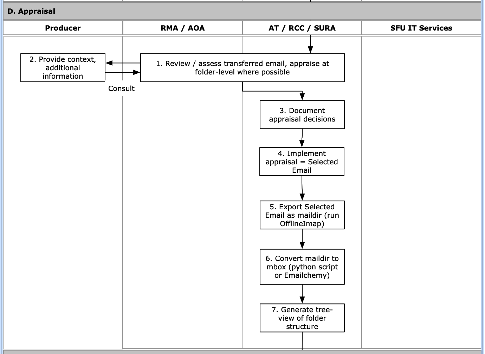

###### [Email Archiving](../README.md) > Transfer Workflow for Archivists
###### [Overview](overview.md) `|` [Pre-transfer](pre-transfer.md) `|` [Transfer](transfer.md) `|` [Validation](validation.md) `|` Appraisal `|` [Ingest](ingest.md) `|` [Completion](completion.md)

# Validation

During the **appraisal phase** the archivist reviews the transferred email and conducts folder-level appraisal if feasible. The archivist deleted folders appraised for destruct and re-exports and converts the email selected for long-term preservation.

## Contents
- [Review / assess transferred email](#review-assess-transferred-email)
- [Document appraisal decisions](#document-appraisal-decisions)
- [Implement appraisal / select folders](#implement-appraisal-select-folders)
- [Re-export selected emails](#re-export-selected-emails)

## Review / assess transferred email
[Workflow Diagram, steps D1-D2](../images/transfer-workflow.png)

## Document appraisal decisions
[Workflow Diagram, step D3](../images/transfer-workflow.png)

## Implement appraisal / select folders
[Workflow Diagram, step D4](../images/transfer-workflow.png)

## Re-export selected emails
[Workflow Diagram, steps D5-D7](../images/transfer-workflow.png)

###### Last updated: Jul 26, 2022
