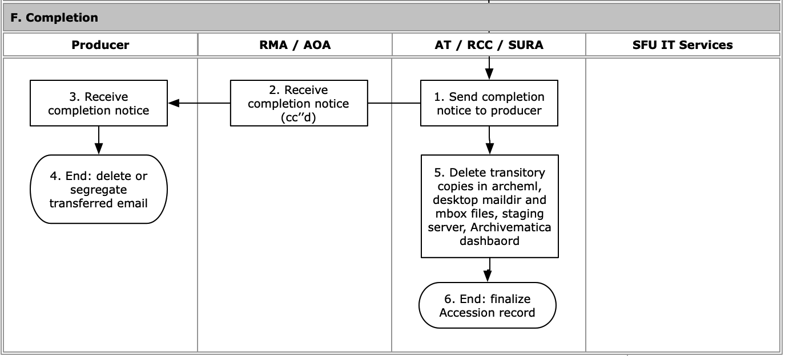

###### [Email Archiving](../README.md) > Transfer Workflow for Archivists
###### [Overview](overview.md) `|` [Pre-transfer](pre-transfer.md) `|` [Transfer](transfer.md) `|` [Validation](validation.md) `|` [Appraisal](appraisal.md) `|` [Ingest](ingest.md) `|` Completion

# Completion

**Completion** finalizes the transfer. The archivist notifies the producer that the transfer has been completed, deletes temporary transitory copies of the email, and updates the collection file. The producer may now delete the transferred email from their active account.

## Contents
- [Send completion notice](#send-completion-notice)
- [Delete transitory copies](#delete-transitory-copies)
- [Finalize the Accession record](#finalize-the-accession-record)

## Send completion notice
[Workflow Diagram, steps F1-F4](../images/transfer-workflow.png)

## Delete transitory copies
[Workflow Diagram, step F5](../images/transfer-workflow.png)

## Finalize the Accession record
[Workflow Diagram, step F6](../images/transfer-workflow.png)

###### Last updated: Jul 29, 2022
