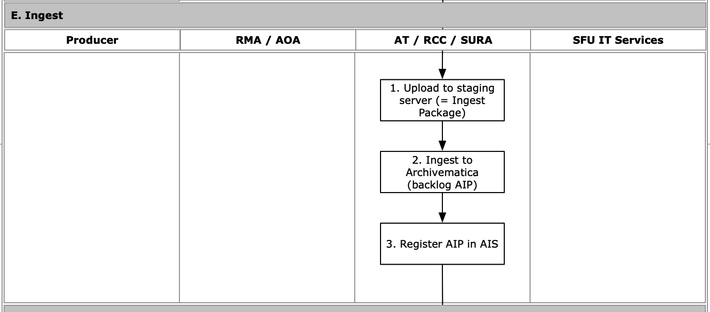

###### [Email Archiving](../README.md) > Transfer Workflow for Archivists
###### [Overview](overview.md) `|` [Pre-transfer](pre-transfer.md) `|` [Transfer](transfer.md) `|` [Validation](validation.md) `|` [Appraisal](appraisal.md) `|` Ingest `|` [Completion](completion.md)

# Ingest

**Ingest** is the upload and processing of email through Archivematica to create an Archival Information Package (AIP) for long-term preservation.

## Contents
- [Upload to staging server](#upload-to-staging-server)
- [Ingest to Archivematica](#ingest-to-archivematica)
- [Register AIP in AIS](#register-aip-in-ais)

## Upload to staging server
[Workflow Diagram, step E1](../images/transfer-workflow.png)

## Ingest to Archivematica
[Workflow Diagram, step E2](../images/transfer-workflow.png)

## Register AIP in AIS
[Workflow Diagram, step E2](../images/transfer-workflow.png)

###### Last updated: Jul 29, 2022
