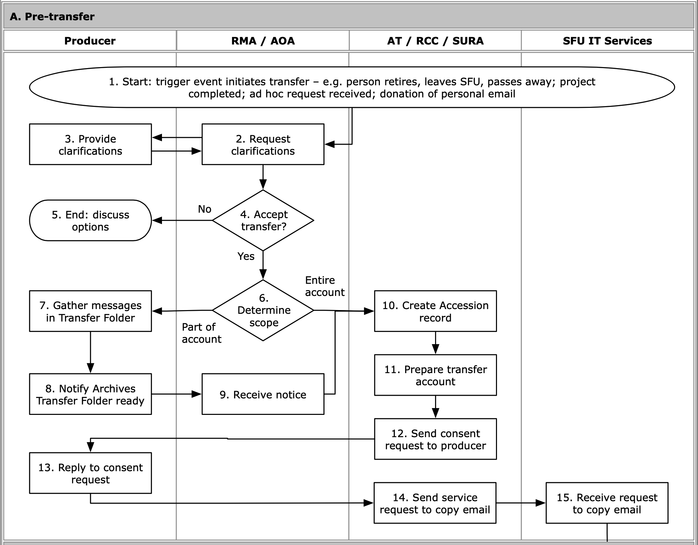

###### [Email Archiving](../README.md) > Transfer Workflow for Archivists
###### [Overview](overview.md) `|` Pre-transfer `|` [Transfer](transfer.md) `|` [Validation](validation.md) `|` [Appraisal](appraisal.md) `|` [Ingest](ingest.md) `|` [Completion](completion.md)

# Pre-Transfer

During the **pre-transfer phase** an archivist consults with an account-holder ("producer") in order to determine whether or not to begin an email transfer project. If yes, the archivist creates an `Accession record` in the AIS and submits a service request ticket with SFU IT Services to copy the email to a dedicated Archives' transfer account.
- See the Archives' internal wiki for details of transfer account name and ITS contact email address.

## Contents
- [Initiate transfer](#initiate-transfer)
- [Accept or reject transfer](#accept-or-reject-transfer)
- [Determine scope](#determine-scope)
- [Create Accession record](#create-accession-record)
- [Prepare the Archives' transfer account](#prepare-the-archives-transfer-account)
- [Send consent request to producer](#send-consent-request-to-producer)
- [Send transfer request to ITS](#send-transfer-request-to-its)

## Initiate transfer
[Workflow Diagram, steps A1-A3](../images/transfer-workflow.png)

At present, most email transfers are triggered in ad hoc fashion, either at the request of the producer (or their estate) or on the Archives' initiative when we became aware of the retirement or passing away of a faculty member or senior administrator.

However initiated, at this stage an archivist consults with the account holder, their estate, or other senior administrators to determine the suitability of the email for long-term preservation.

## Accept or reject transfer
[Workflow Diagram, steps A4-A5](../images/transfer-workflow.png)

The archivist decides to accept or reject the proposed transfer. For selection criteria, see the discussion at [Account-Level Appraisal](appraisal/account-level-appraisal.md).
- If a transfer is rejected, the archivist should communicate this decision in writing to the producer and document the rationale in an appraisal report.

## Determine scope
[Workflow Diagram, steps A6-9](../images/transfer-workflow.png)

The Archives may acquire an entire account or just part of it.

- The Archives takes **part** of an account by targeting specific folders for transfer; this typically happens when the account will continue to be active following transfer (e.g. the email creator is retiring but will continue to use the account).

- The Archives may acquire an **entire account** if it is inactive and it is not possible for the producer to access the account or undertake selection (e.g. the email creator has left the university or passed away).

If scope = partial:

- Advise the producer about the types of email that should be transferred (see the Archives' guidelines on [Email Management Best Practices](https://www.sfu.ca/content/dam/sfu/archives/PDFs/RecordsManagement/GLD058_EmailManagementBestPractices_v1.0.pdf), especially the section on Retention and Disposition of Email).

- The producer must create a `Transfer Folder` in the `Inbox` of their account, move all messages and folders for transfer to it, and notify the Archives when the `Transfer Folder` is ready.

## Create Accession record
[Workflow Diagram, steps A10](../images/transfer-workflow.png)

In the AIS, create a new `Accession` record:

- Open the AIS **Archives Module** and navigate to the **Home > Accessions** tab.

- Click the `+ New accession` button.

- Complete fields on the **Data Entry** screen.

- On the **Methods** tab, `Transfer method` = "Network transfer".

## Prepare the Archives' transfer account
[Workflow Diagram, steps A11](../images/transfer-workflow.png)

Transfer takes place by ITS making a copy of the producer's `Transfer Folder` to the Archives' sponsored account dedicated to email transfer.

Always keep the Archives' transfer account empty between transfers.

- It is generally better to process one transfer at a time through the account; this way, you can use the [OfflineImap tool](../overview/software.md#OfflineImap) on the entire transfer account rather than on specific folders within it (the latter is more cumbersome).

- It is possible (but not preferred) to work on multiple transfers in the account at the same time, but make sure they are in separate top-level folders.

Open the Archives' transfer account in Microsoft Office.

- There may be some administrative or mail-list messages, e.g. notices that the sponsored account is due for renewal; delete these.

- If there any messages belonging to previous transfers, ensure that those transfers have really been completed; if yes, delete.

- Create a new `Transfer Folder` using the `Accession number`, e.g. `ACN2022-045_LastName`.

## Send consent request to producer
[Workflow Diagram, steps A12-13](../images/transfer-workflow.png)

Send an email to the producer summarizing the details of the transfer and request them to reply to signal their consent. Attach the [Information for Account Holders pdf document](/downloads/information-for-account-holders.pdf).

- See the [producer consent template here](../downloads/producer-consent-template.txt).

- The producer should reply back with a simple "I consent to this transfer of my email" and include their email signature if they use one.

## Send transfer request to ITS
[Workflow Diagram, steps A14-15](../images/transfer-workflow.png)

When you receive the consent email reply, send an email to the ITS contact to start a service ticket to make a copy of the `Transfer Folder` from the producer's account to the Archives' transfer account.

- See the Archives' internal wiki for the ITS email address.

- Include the producer as a cc.

- Include (forward) the consent message thread with the producer.

Include the following information in the email request:
- Scope: entire account or folder + sub-folders
- Name of producer's account
- Name of producer's `Transfer Folder` (source)
- Name of Archives' account
- Name of Archives' `Transfer Folder` (destination)

See the [service request template here](../downloads/service-request-template.txt).

###### Last updated: Jul 22, 2020
