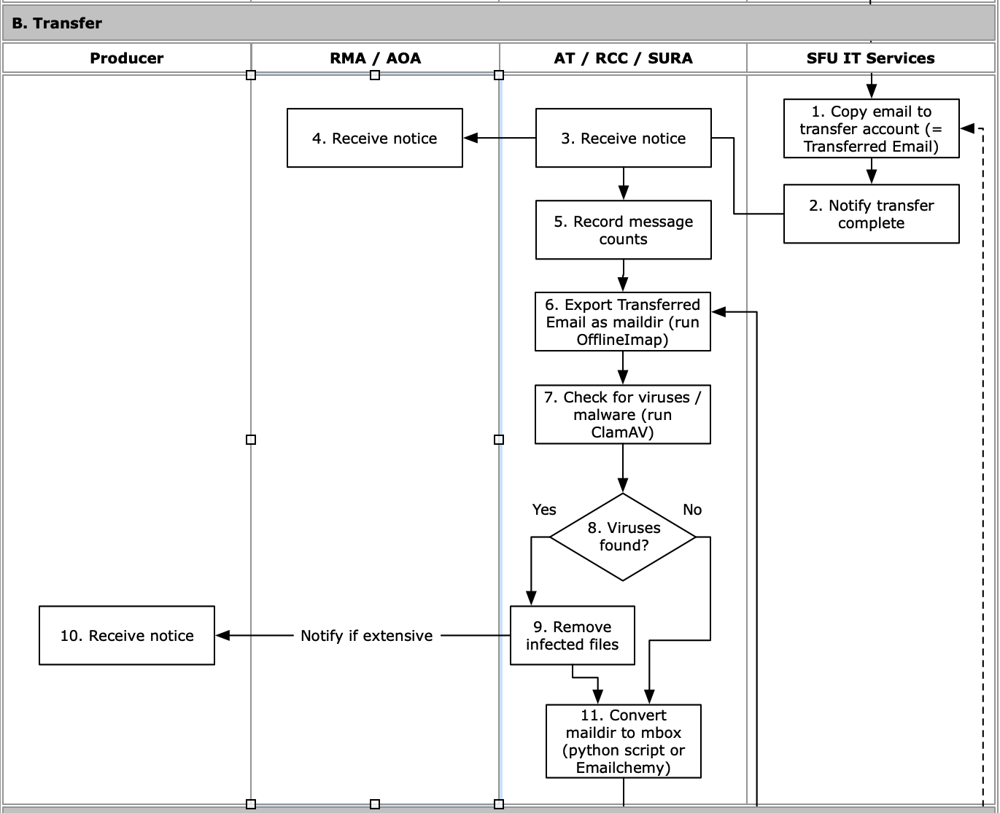

###### [Email Archiving](../README.md) > Transfer Workflow for Archivists
###### [Overview](overview.md) `|` [Pre-transfer](pre-transfer.md) `|` Transfer `|` [Validation](validation.md) `|` [Appraisal](appraisal.md) `|` [Ingest](ingest.md) `|` [Completion](completion.md)

# Transfer


During the **transfer phase** SFU IT Services makes a copy of the `Transfer Folder` to the Archives' dedicated email transfer account. An archivist exports the email in `maildir` format, runs virus checks, then converts the `maildir` to `mbox` format.

## Contents
- [Receive notice from ITS](#receive-notice-from-its)
- [Export as maildir](#export-as-maildir)
- [Check for viruses and malware](#check-for-viruses-and-malware)
- [Convert maildir to mbox](#convert-maildir-to-mbox)

## Receive notice from ITS
[Workflow Diagram, steps B1-B4](../images/transfer-workflow.png)

ITS will make a copy of the producer's `Transfer Folder` to the Archives' transfer account and notify the archivist who submitted the service request ticket when this is complete.

## Export as maildir
[Workflow Diagram, step B5](../images/transfer-workflow.png)

An archivist runs OfflineImap on the `Transfer Folder` to export all messages and attachments.
- For installation instructions and more information about this utility, see the OfflineImap page in the Archives' [Digital Repository Utilities GitHub site](https://github.com/SFU-Archives/digital-repository-utilities).

### Config file
The first time you run OfflineImap you will need to edit the configuration file.
- This is a Mac "hidden" file stored in your Home directory at `~/.offlineimaprc`.
- You can view Mac hidden files by pressing `SHIFT` + `COMMAND` + `.`
- Edit the config file with a text editor, e.g. BBEdit.
- See the [OfflineImap config file template](../downloads/offlineimap-config-file.txt).

The main settings you need to specify are:
- `localfolders` = folder for output on your local computer.
- `remoteuser` = user name of Archives' sponsored email account for transfer.
- `remotepass` = account password; you can enter or delete this line; if deleted you will be prompted for the password when running OfflineImap; if used, **delete this line when you have finished the transfer.**
- See the Archives' internal wiki for full settings.

You will not need to change these settings (except perhaps `remotepass`) if you subsequently run OfflineImap on the entire Archives' transfer account (i.e. the account contains only a single `Transfer Folder` and its Contents).

If the transfer account holds multiple transfer folders, you will need to specify the individual target folder (plus all its subfolders) in the config file:
- `folderfilter = lambda folder: folder in ['folder1', 'folder1/folder2']`
- If exporting the entire transfer account, delete the `folderfilter` line from the config file.

Listing all sub-folders in `folderfilter` can be time-consuming for transfers with a complex folder hierarchy; that is why it is advisable and simpler to process one transfer at a time through the Archives' email transfer account, export the entire account, then empty it out for the next one.

### Run the program
To run OfflineImap:
- Open a Terminal window.
- Enter `$ offlineimap` and hit return.

If you did not include the account password in the `remotepass` flag in the config file, you will prompted to enter the password in the Terminal window.

The utility will export all messages with attachments to the `localfolders` location specified in the config file.

## Check for viruses and malware
[Workflow Diagram, steps B6-B8](../images/transfer-workflow.png)

Check for viruses and malware by running ClamAV on the `maildir` output.
- It is important to do this before converting to `mbox`: with `maildir`, individual infected messages can be deleted, whereas with `mbox` one virus in one message means the whole folder (entire `mbox` file) is compromised.
- For installation instructions and more information about this utility, see the [ClamAV page](https://github.com/SFU-Archives/digital-repository-utilities/blob/master/utilities/clamav.md) in the Archives' [Digital Repository Utilities site](https://github.com/SFU-Archives/digital-repository-utilities).

Open a Terminal window to run ClamAV.

```
$ freshclam
$ clamscan -ri --log=<<PATH_TO_LOG/log.txt>> <<PATH_TO_MAILDIR_FOLDER>
```

The `freshclam` command updates the virus database.

The `clamscan` command runs the virus scan.
- `-r` flag = recursive, i.e. it will run on all sub-folders and their contents.
- `-i` flag = show only infected files.
- `--log` flag = write results to a log file at the location specified; the `log.txt` file should already exist before you run the scan.
- You can omit writing to a log file; in either case, the output will show in your Terminal window.
- To get the path to the `maildir` folder, you can you just drag it into your Terminal window.

### If you find infected files
If ClamAV turns up infected files, document this in a note to the collection file and remove and delete the files.
- You should advise the producer if you find extensive viruses and malware in their email.

## Convert maildir to mbox
[Workflow Diagram, step B9](../images/transfer-workflow.png)

There are two ways to convert the `maildir` to `mbox`: by customized Python script ([maildir2mbox](#maildir2mbox)); or by using the [Emailchemy app](#emailchemy).
- The Python script was originally adapted by the Archives ca. 2013; it is free, open-source and runs on command line.
- Emailchemy was acquired in 2022; it provides a user interface and supports conversions to multiple formats, but it is proprietary software and costs money (ca. $30 for the "personal edition" version).
- The personal edition of Emailchemy will insert a line of code into the header of each converted message `X-Converted-By: Emailchemy 14.4.6 Personal Edition; licensedTo="<<Name>>".`

### maildir2mbox script
Download the script from the shared drive at `ITM002-40 > maildir2mbox > maildir2mbox.py`.
- The script can be run from any location on your computer.
- For more information about the script (including code), see the [maildir2mbox](https://github.com/SFU-Archives/digital-repository-utilities/blob/master/utilities/maildir2mbox.md) page on the Archives' [Digital Repository Utilities site](https://github.com/SFU-Archives/digital-repository-utilities).

To run, open a Terminal window:
- `$ python3 <<path/to/script>> <<path/to/maildir/input/folder/>> <<path/to/mbox/output/folder/>>`

The script will save the `mbox` files (1 for each folder in the `maildir` collection) to the location specified in the last argument of the command.

### Emailchemy


Open the Emailchemy app.
- From the drop-down list (`What kind of email do you want to convert?`) select "Maildir (IMAPdir)" and click `Next`.
- Use the `Browse` button to the top-level folder containing the `maildir` and click `Next`.
- Check `Filter duplicate messages`; leave other boxes unchecked and click `Convert`.
- Enter a folder title and select the location for the `mbox` output and click `Save`.

Emailchemy will save the `mbox` files (1 for each folder of the `maildir` collection) to the location you specified.

###### Last updated: Jul 26, 2022
