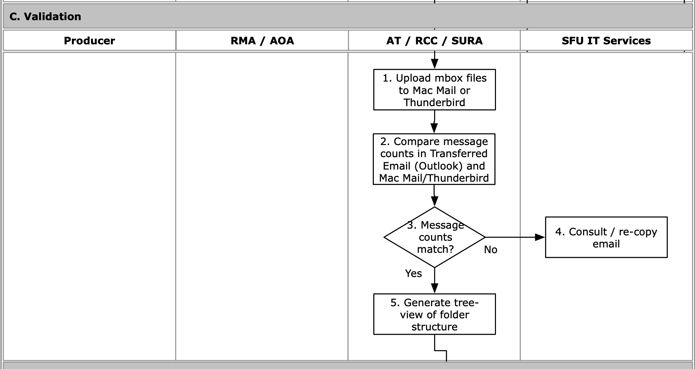

###### [Email Archiving](../README.md) > Transfer Workflow for Archivists
###### [Overview](overview.md) `|` [Pre-transfer](pre-transfer.md) `|` [Transfer](transfer.md) `|` Validation `|` [Appraisal](appraisal.md) `|` [Ingest](ingest.md) `|` [Completion](completion.md)

# Validation

During the **validation phase** the archivist confirms that no data was lost during transfer, export to `maildir` and conversion to `mbox`. There is no easy way to do this. For now, the Archives relies on a comparison between (i) the number of messages in the `Transfer folder` after ITS copies it to the Archives' transfer account and (ii) the number of messages in an email browser (Thunderbird or Mac Mail) after the `mbox` files are loaded.

## Contents
- [Load mbox files into an email browser](#load-mbox-files-into-an-email-browser)
- [Compare message counts](#compare-message-counts)
- [If message counts do not match](#if-message-counts-do-not-match)
- [Generate tree view of folder structure](#generate-tree-view-of-folder-structure)

## Load mbox files into an email browser
[Workflow Diagram, step C1](../images/transfer-workflow.png)

## Compare message counts
[Workflow Diagram, steps C2-C3](../images/transfer-workflow.png)

## If message counts do not match
[Workflow Diagram, step C4](../images/transfer-workflow.png)

## Generate tree view of folder structure
[Workflow Diagram, step C5](../images/transfer-workflow.png)

###### Last updated: Jul 26, 2022
