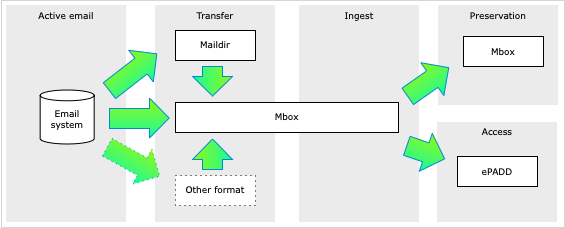

###### [Home](../README.md) > [Guide for email archives](./guide-introduction.md)
###### [1. Software](./s1-software.md) `|` 2. Formats `|` [3. Workflow](./s3-workflow.md) `|` [4. Acquisition](./s4-acquisition.md) `|` [5. Transfer methods](./s5-transfer-methods.md) `|` [6. Appraisal and selection](./s6-appraisal-and-selection.md) `|` [7. Arrangement and description](./s7-arrangement-and-description.md) `|` [8. Preservation](./s8-preservation) | [9. Access](./s9-access)

# 2. Formats
**Contents**
- [2.1 Preferred formats](#21-preferred-formats)
- [2.2 SFU email platform](#22-sfu-email-platform)
- [2.3 Mbox](#23-mbox)
- [2.4 Maildir](#24-maildir)
- [2.5 ePADD](#25-epadd)
- [2.6 Attachments](#26-attachments)

## 2.1 Preferred formats

The Archives' preferred formats for managing email are:
- **Transfer:** `maildir`, `mbox`
- **Ingest:** `mbox`
- **Preservation:** `mbox`
- **Access:** `ePADD`

 

## 2.2 SFU email platform
The university's email system ([SFU Mail](https://www.sfu.ca/sfumail.html)) runs on Microsoft Exchange (server) and Outlook (client). SFU switched to Microsoft for email in 2018. From 2009-2018 the university used the [Zimbra Collaboration Suite](https://www.zimbra.com) as [SFU Connect](https://www.sfu.ca/content/sfu/itservices/sfuconnect.html), and the Archives' first email transfers were from the Zimbra system.

## 2.3 Mbox
`mbox` originated with the Unix operating system as a format for storing email messages, and there are several variants within the `mbox` family. In 2005 the Internet Engineering Task Force ([IETF](https://www.ietf.org)) defined a standard `application/mbox` media type ([RFC4155](https://tools.ietf.org/html/rfc4155)), and `mbox` has become a defacto standard for moving email between different email systems and clients.

A single `mbox` file represents a folder and its contents in an email system.
- It aggregates into a single text file all the messages contained in an email folder, along with their attachments.
- Message headers and body are represented in plain text.
- Attachments are encoded in [Base64](https://en.wikipedia.org/wiki/Base64) as ASCII text appended to the message.

`mbox` files are mainly designed for storage. While they can be opened with any text editor and the header and body of messages (but not the attachments) are human-readable, access to `mbox` is generally via an email client / reader.

Given its wide use and the availability of cross-platform tools that can work with it, `mbox` is the Archives' preferred **preservation format**. But the Archives' digital preservation software, Archivematica, cannot normalize email to `mbox`; this must be done independently prior to ingest. Similarly, ePADD needs email already in `mbox` format for upload. For these reasons, `mbox` is also our preferred **ingest** format.

While some email systems may be able to natively export to `mbox` (e.g. Gmail), others (including SFU Mail) may do so poorly or require the production of an intermediary. SFU Archives uses a tool (OfflineImap) to export email out of the active system in `maildir` format, then runs a Python script to convert the `maildir` to `mbox`.

In general, for a format to be acceptable for transfer to SFU Archives, there must be a tool that allows conversion to `mbox`.

## 2.4 Maildir
Like `mbox`, `maildir` is also an email storage format that represents email messages (header, body, attachments) as text files, with attachments encoded as Base64 ASCII. But where `mbox` aggregates all messages from the same mailbox into a single file, `maildir` stores each individual email message (plus attachments) as its own separate text file.

`mbox` seems to be more widely used, perhaps because it can store the same amount of email in a much smaller number of files. But the Archives' main export / transfer tool, OfflineImap, outputs only to `maildir`. For the Archives, `maildir` is intermediary **transfer format**. We use a Python script to convert it to `mbox` for ingest, and we do not retain the `maildir` copy once ingest is complete.

## 2.5 ePADD

## 2.6 Attachments

###### Last updated: Jul 10, 2020
