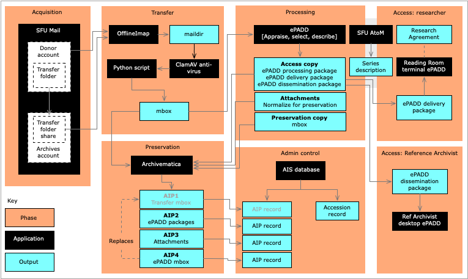

###### [Email Archiving](../README.md) > [Guide](./00-introduction.md)
###### [1. Software](./01-software.md) `|` [2. Formats](./02-formats.md) `|` 3. Workflow `|` [4. Acquisition](./04-acquisition.md) `|` [5. Transfer methods](./05-transfer-methods.md) `|` [6. Appraisal and selection](./06-appraisal-and-selection.md) `|` [7. Arrangement and description](./07-arrangement-and-description.md) `|` [8. Preservation](./08-preservation) | [9. Access](./09-access)

# 3. Workflow

The section gives the workflow in outline for transfers of SFU email.

1. Gain access to the target email via permissions to a shared transfer folder in the owner's account (active accounts); or temporary ownership of an entire account (inactive accounts).
1. Use OfflineImap to export email from the target account / folder as `maildir`.
1. Run ClamAV on `maildir` to scan for viruses and malware
1. Run a Python script to convert `maildir` to `mbox`.
1. Create an AIS database Accession record for the transfer (the `Accession number` should be included in the Archivematica metadata).
1. Ingest `mbox` to Archivematica as `AIP1`; retain pending full processing.
1. Upload `mbox` to ePADD for appraisal, selection, and curation.
1. Output ePADD packages (`processing`, `dissemination`, and `delivery` packages); ingest to Archivematica as `AIP2` (access copy).
1. Output attachments from ePADD as a separate package; ingest to Archivematica with normalization as `AIP3` (preservation copy of attachments).
1. Output `mbox` from ePADD; ingest to Archivematica as `AIP4` (preservation copy).
1. Delete `AIP1`: `AIP4` replaces it, as `AIP4` includes only emails selected for permanent retention.
1. Register all AIPs in the AIS database, linked to the Accession record.
1. Create a series description in AtoM.
1. Add a copy of the ePADD `dissemination` package to the ePADD collection on the Reference Archivist's desktop computer for use by the archivist in responding to researcher queries.
1. To provide researcher access, retrieve the ePADD `delivery package` from storage, load to the ePADD delivery module installed on a dedicated reading room terminal; access typically requires a Research Agreement.

Note that this outline remains ideal. **Steps 10 and 11 are not yet possible.** The `mbox` file generated by ePADD does not retain the mailbox folder structure of the original transfer (all messages are flattened into one `mbox` file). This makes it less than ideal as the long-term preservation copy.

The issue is on the ePADD's team roadmap for future development. In the meantime, SFU Archives will retain the transfer `mbox` file as the preservation copy. This is also problematic, as it means we are retaining in the AIP emails that were set aside for deletion during processing in ePADD.

If / when this isssue is addressed in ePADD, the Archives will retroactively generate ePADD `mbox` files (`AIP4` in the diagram), ingest these to Archivematica, and delete the transfer `mbox` AIPs (`AIP1` in the diagram).

 

###### Last updated: Jul 21, 2020
