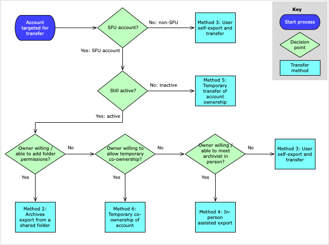

###### [Email Archiving](../README.md) > [Guide](./00-introduction.md)
###### [1. Software](./01-software.md) `|` [2. Formats](./02-formats.md) `|` [3. Workflow](./03-workflow.md) `|` [4. Acquisition](./04-acquisition.md) `|` 5. Transfer methods `|` [6. Appraisal and selection](./06-appraisal-selection.md) `|` [7. Arrangement and description](./07-arrangement-description.md) `|` [8. Preservation](./08-preservation.md) | [9. Access](./09-access.md)

# 5. Transfer methods

Transfer is an operation that exports email from an email server and copies it to a machine or storage device in the Archives' custody or control. Five main approaches have been identified; different methods may be appropriate in different circumstances. All but one ([method 3](#method-3-user-self-export-and-transfer)) requires the use of the open-source utility OfflineImap to export email out of the original system.

**Contents**
- [5.1 Methods](#51-methods)
    - [5.1 ITS backup and restore](#method-1-its-backup-and-restore)
    - [5.2 Archives export from a shared folder](#method-2-archives-export-from-a-shared-folder)
    - [5.3 User self-export and transfer](#method-3-user-self-export-and-transfer)
    - [5.4 In-person assisted export](#method-4-in-person-assisted-export)
    - [5.5 Temporary transfer of account ownership](#method-5-temporary-transfer-of-account-ownership)
    - [5.6 Temporary sharing of account co-ownership](#method-6-temporary-sharing-of-account-coownership)
- [5.2 Decision tree](#52-decision-tree)

## 5.1 Methods

### Method 1: ITS backup and restore
This was the Archives' original transfer method, used from 2013-2016.

The university's IT Services made a backup copy of an account, stored it offline, then restored the backup to a transfer account under the Archives' control. The Archives would then run OfflineImap to export and transfer the email.

This method was most suitable for transfers of inactive SFU accounts (take the entire account). It was successfully used with SFU's previous email platform, the Zimbra Collaboration Suite (used at the university from 2009-2018). It has now been superseded by [method 5 below](#method-5-temporary-transfer-of-account-ownership) in SFU's present Microsoft email system.

### Method 2: Archives export from a shared folder
This is the preferred method for transfers of email from ongoing, active SFU accounts, e.g. current staff, staff / faculty who retire but retain their accounts, or role-based departmental accounts.

The account owner creates a transfer folder within their account, moves folders and emails to the transfer folder, and creates permissions that share the transfer folder(s) with Archives. The Archives then run OfflineImap on the shared folder to export and transfer the email.

The [Transfer procedures page](../transfer-procedures/transfer-home.md) contains documentation for this method for both [account owners](../transfer-procedures/account-owners/00-introduction.md) and [SFU archivists](../transfer-procedures/archives/00-introduction.md).

The main drawback with this method is that it requires account owners to add permissions to each and every folder included in the transfer. Depending on how the owners structured their email account, this may entail considerable work (e.g. if they organized their email into a large number of folders, with multiple sub- and sub-sub-folders). Methods [4 (in-person)](#method-4-in-person-assisted-export) and [6 (temporary co-ownership)](#method-6-temporary-sharing-of-account-coownership) provide alternative workarounds.

### Method 3: User self-export and transfer
This is currently the only method for transfers of non-SFU email.

The account holder exports their own email by themselves into a format acceptable to the Archives, then transfers it following the Archives' standard digital transfer procedures. At present, the only acceptable transfer formats are `mbox` and `maildir` (see in this Guide [section 2, Formats](./02-formats.md).

Some donors may lack sufficient technical knowledge to manage their own export. The Archives may be able to provide support on a case-by-case basis depending on the email system and the donor's computing environment. The approach was successfully tested in 2019 with Gmail, which can be easily exported in `mbox` formats; see [transfer procedures for accounts owners, section 3.1](../transfer-procedures/account-owners/03-non-sfu-accounts.md5) for instructions for Gmail. Over time, the Archives will seek to add similar instructions for other common email services (e.g. hotmail, yahoo).

For the Archives' standard digital transfer procedures, see the [Transfer Digital Records page](http://www.sfu.ca/archives/digital-repository/transfer-digital-records.html) on the [SFU Archives' website](http://www.sfu.ca/archives.html). This documentation will eventually be moved over to a separate repository on this GitHub site.

### Method 4: In-person assisted export
This method is an alternative to [method 2, export from a shared folder](#method-2-archives-export-from-a-shared-folder). It provides a workaround when the account owner is unable or unwilling to manually add permissions to a large number of transfer folders.

In this scenario, an archivist meets with the account owner and uses the Archives' own utilities to transfer the email – e.g. the donor comes in person to the Archives, or an archivist visits the donor with an Archives' laptop computer. The archivist runs OfflineImap on the owner's account, with the account owner entering their credentials (password) when prompted to export the email to an Archives' machine or storage device. The account owner's password is not stored or retained by the Archives.

With this method the Archives may take either targeted transfer folders or a copy of the entire account, depending on the agreement with the donor.

In principle OfflineImap should work with any IMAP-based email system, so that this method is not limited to SFU account. But in practice, the Archives has to date only tested it with SFU email.

### Method 5: Temporary transfer of account ownership
This is the preferred method for transfers of inactive accounts, e.g. the account of an administrator or faculty member who passes away and the estate agrees to donate their email.

In this scenario ITS transfers temporary ownership of the account to the Archives, i.e. it re-sets the account password and provides this to Archives. The Archives then runs OfflineImap against the account to export the email to one of its own machines. ITS then re-sets the password so the Archives has no further access.

This method has not yet been tested, but should be fairly straightforward.

Note that SFU does not currently have a formal policy relating to the retention and disposal of inactive email accounts. The Archives generally treats this as a donation of records negotiated with the account owners or their estate.

### Method 6: Temporary sharing of account co-ownership
This method is an additional alternative to [method 2, export from a shared folder](#method-2-archives-export-from-a-shared-folder). Like 5.2, it provides a workaround when the account owner is unable or unwilling to manually add permissions to a large number of transfer folders.

In this approach, the account owner agrees to allow the Archives to be a temporary co-owner of the account. ITS assigns the permission, and the Archives can access the account to run OfflineImap and export the target email folders. The Archives uses a separate set of credentials (user name and password), so it does not require access to the owner's own credentials. Nevertheless, the method is invasive and requires a high level of trust between the donor and the Archives. It represents a "last resort" approach when no other method is feasible, and it has not to date been attempted.

## 5.2 Decision tree
The following diagram sketches out the decision-making process for selecting a transfer method.

Note that if an owner of an SFU active account is unwilling or unable to create folder permissions, allow temporary co-ownership of the account, or meet with an archivist in-person, the only fallback is [method 3, user self-export and transfer](#method-3-user-self-export-and-transfer). The account owner will have to install OfflineImap (or some other suitable tool) and manage the export of their email themselves.

###### Page last updated: Aug 11, 2020
