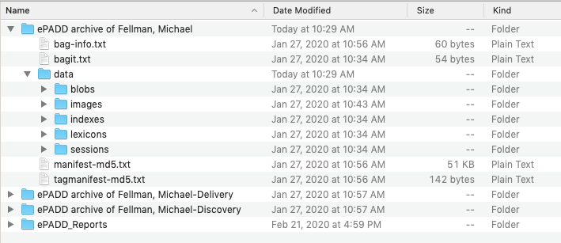

###### [Email Archiving](../README.md)
###### [Email Archiving at SFU](email-archiving-at-sfu.md) `|` [Software](software.md) `|` Formats `|` [Transfer Workflow](transfer-workflow.md)

# Email Archiving: Formats

**Contents**
- [Preferred formats](#preferred-formats)
- [SFU email platform](#sfu-email-platform)
- [Mbox](#mbox)
- [Maildir](#maildir)
- [ePADD](#epadd)
- [Attachments](#attachments)

## Preferred formats

The Archives' preferred formats for managing email are:
- **Transfer:** `maildir`, `mbox`
- **Ingest:** `mbox`
- **Preservation:** `mbox`
- **Access:** `ePADD`

 

## SFU email platform
The university's email system ([SFU Mail](https://www.sfu.ca/sfumail.html)) runs on Microsoft Exchange (server) and Outlook (client). SFU switched to Microsoft for email in 2018. From 2009-2018 the university used the [Zimbra Collaboration Suite](https://www.zimbra.com) as [SFU Connect](https://www.sfu.ca/content/sfu/itservices/sfuconnect.html), and the Archives' first email transfers were from the Zimbra system.

## Mbox
`mbox` originated with the Unix operating system as a format for storing email messages, and there are several variants within the `mbox` family. In 2005 the Internet Engineering Task Force ([IETF](https://www.ietf.org)) defined a standard `application/mbox` media type ([RFC4155](https://tools.ietf.org/html/rfc4155)), and `mbox` has become a defacto standard for moving email between different email systems and clients.

A single `mbox` file represents a folder and its contents in an email system.
- It aggregates into a single text file all the messages contained in an email folder, along with their attachments.
- Message headers and body are represented in plain text.
- Attachments are encoded in [Base64](https://en.wikipedia.org/wiki/Base64) as ASCII text appended to the message.

`mbox` files are mainly designed for transfer and storage. While they can be opened with any text editor and the header and body of messages (but not the attachments) are human-readable, access to `mbox` is generally via an email client / reader.

`mbox` is the Archives' preferred **preservation format** due to its wide use, compatibility with multiple email systems, simplicity of structure (as basic ASCII text), and the availability of cross-platform tools that can work with it. But the Archives' digital preservation software, Archivematica, cannot normalize email to `mbox`; this must be done independently prior to ingest. Similarly, ePADD needs email already in `mbox` format for upload. For these reasons, `mbox` is also our preferred **ingest** format.

While some email systems may be able to natively export to `mbox` (e.g. Gmail), others (including SFU Mail) may do so poorly or require the production of an intermediary. SFU Archives uses a tool (OfflineImap) to export email out of the active system in `maildir` format, then runs a Python script to convert the `maildir` to `mbox`.

In general, for a format to be acceptable for transfer to SFU Archives, there must be a tool that allows conversion to `mbox`.

## Maildir
Like `mbox`, `maildir` is an email storage format that represents email messages (header, body, attachments) as text files, with attachments encoded as Base64 ASCII. But where `mbox` aggregates all messages from the same mailbox into a single file, `maildir` stores each individual email message (plus attachments) as its own separate text file.

The granularity of `maildir` gives it some advantages. Single messages that have been corrupted or infected with malware can be readily isolated from the others in the same mailbox folder.

But `mbox` is more widely used, and for the Archives `maildir` is intermediary **transfer format**. Our transer / export tool (`OfflineImap`) exports only to `maildir`. We use a Python script to convert output to `mbox` for ingest, and we do not retain the `maildir` copy once ingest is complete.

## PST files
`pst` (Personal Storage Table) files are a Microsoft-specific format for storing copies of email messages and attachments, but also calendar events, tasks, and contacts. SFU Archives has not acquired `pst` files and it is a non-preferred format.

Our initial analysis is that `pst` files are typically less complete and reliable than `mbox` and that the tools for migrating them to `mbox` are not always robust. The Archives' preference at the present time is to use `OfflineImap` to export email from Microsoft Exchange / Outlook email systems as `maildir`, then convert the `maildir` to `mbox` by script. But our experience to date with this method is restricted to working with SFU email.

There may be circumstances where privately donated materials include `pst` files and this is the only format available. When / if this occurs, the Archives will look more closely into tools for dealing with this format.

## ePADD

ePADD software allows an archivist to work on a collection of `mbox` files to appraise, select, and describe email archives. It provides a number of curation features, including support for message annotation and tagging, grouping by correspondent, entity analysis, and management of restrictions.

Processed materials are output as three separate ePADD packages:
- the processed email;
- the discovery copy: a redacted version displaying only names of entities, all other text being removed; intended to be suitable for online dissemination;
- the delivery copy: the full email for messages cleared for access; intended to be delivered in a stand-alone, offline envirnment.

Each ePADD package is stored as a Bag, following the BagIt specification. Within the Bag `data` folder, the content is stored in an ePADD-specific structure in the sense that it can only be accessed and rendered via ePADD software. For this reason, SFU Archives treats the set of ePADD packages as the **access copy**, but continues to rely on `mbox` as the long-term **preservation copy**. This does mean, however, that the ePADD-specific curation features added during processing are only retained in the access copy and **not** in the preservation `mbox` file(s).

ePADD itself can generate `mbox` files, and ideally the preservation copy would be an `mbox` created by ePADD after selection and processing is complete. However, a significant limitation of ePADD (as of version 2.7.3) is that it creates only a single `mbox` file without preserving the folder structure of the original transfer (this folder structure is preserved in the ePADD version, but is lost on export to `mbox`).

Until this is addressed, the Archives will continue to rely on the `mbox` files generated at transfer as the preservation copy. This has a significant downside, as it means that the preservation copy includes messages and attachments that were designated for destruction during ePADD appraisal, selection, and processing. In the long-term, the Archives hopes ePADD will improve `mbox` creation to retain original folder structure (the issue is on the development team's roadmap). If / when this occurs, the Archives will create ePADD-generated `mbox` files to replace the pre-processed versions currently ingested to Archivematica.

 

## Attachments
Attachments are written to `mbox` files as Base64 ASCII text and in ePADD retained in their original file formats. In both cases, no preservation actions are taken on the files themselves, making them at risk of becoming inaccessible in the future.

The Archives' current strategy is to use ePADD's ability to export attachments to create a standalone package consisting of all email attachments. This is then ingested to Archivematica, with full preservation and access normalization applied to all files.

One difficulty with this approach is protecting the link between an attachment and its parent message. In ePADD, all attachments are assigned a unique sequential ID number embedded in the file name. If an attachment in its original file format becomes unreadable in the ePADD access copy, it will be possible to identify the file within the package of attachments and retrieve the preservation or access copy from offline storage.

This seems likely to be a cumbersome operation. Moreover, the ePADD-assigned ID numbers will not be present in the preservation `mbox` version. In general, management of attachments is an area requiring more investigation and work.

###### Last updated: Apr 21, 2022
