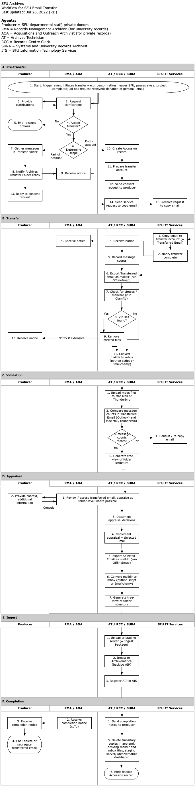

###### [Email Archiving](../README.md)
###### [Email Archiving at SFU](email-archiving-at-sfu.md) `|` [Software](software.md) `|` [Formats](formats.md) `|` Transfer Workflow

# Transfer Workflow
The page outlines in brief the workflow for transfers of SFU email. For more detail (from the archivist's point of view), see the sections on [Transfer Workflow](../archivists/overview.md).

### [Pre-transfer](../archivists/transfer.md)
The account owner ("producer") and archivist negotiate transfer agreement and determine the scope of transfer (entire account or specific folders). The producer prepares a `Transfer Folder`, the archivist submits a service request ticke to SFU IT Services (ITS).

### Transfer
ITS makes a copy of the targeted email `Transfer Folder` and copies it to a dedicated email account controlled by the Archives. The archivist uses OfflineImap to export the messages + attachments as `maildir`, runs a virus scan, then converts the `maildir` to `mbox` format.

### Validation
The archivist opens the `mbox` files in Thunderbird or Mac's Mail email client to get a count of messages transferred and compares this against the number of messages in the transfer account in SFU Mail.

### Appraisal
Where feasible, the archivist undertakes a folder-level appraisal, documents appraisal decisions and eliminates folders not selected for long-term preservations.

### Ingest
The archivist re-exports the appraisal email as `maildir`, converts to `mbox`, uploads the `transfer package` to the staging server on SFU Cloud, processes through Archivematica as a "backlog AIP", and registers the AIP in the AIS database.

### Completion
The archivist notifies the account holder that the transfer has been completed, completes the `Accession record`, and deletes all transitory copies from SFU Mail, desktop, and staging server. The account holder receives the completion notice and may now delete the transferred email if desired.

 

###### Last updated: Jul 22, 2022
