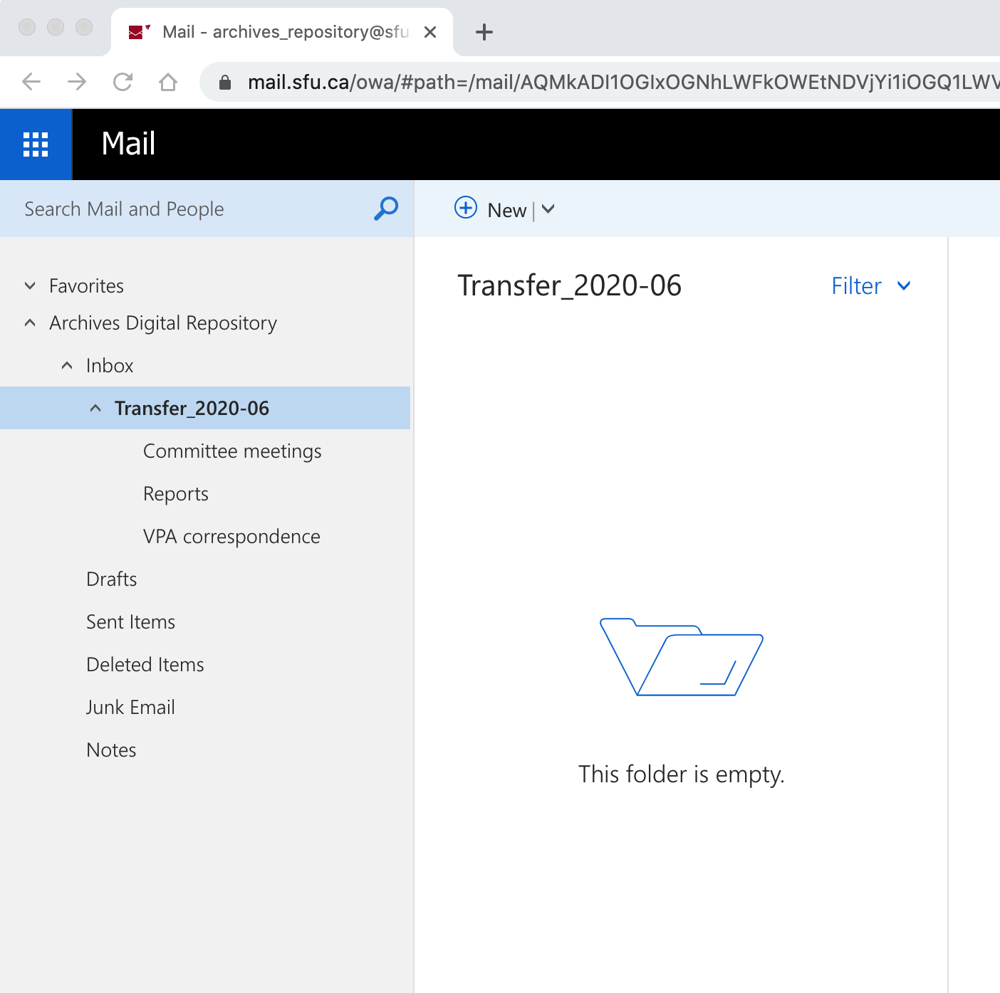
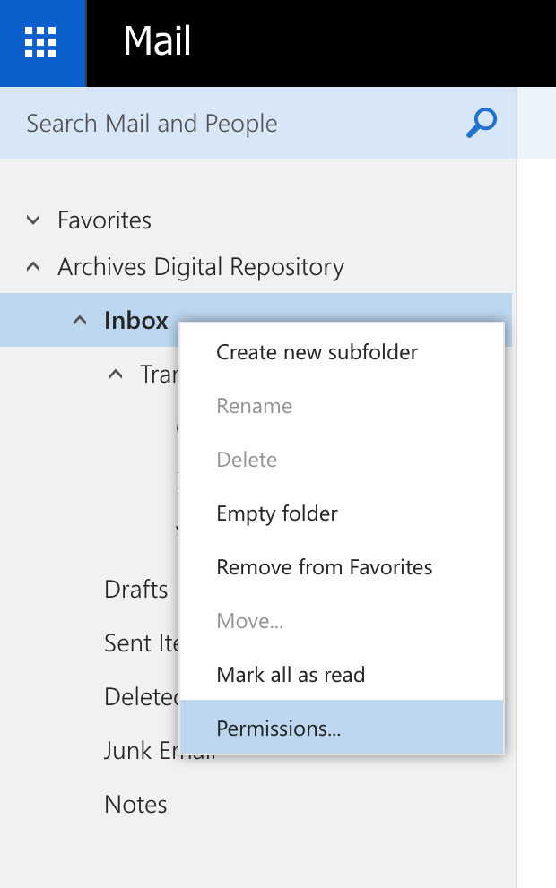
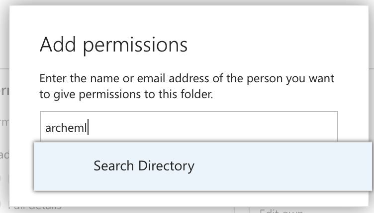
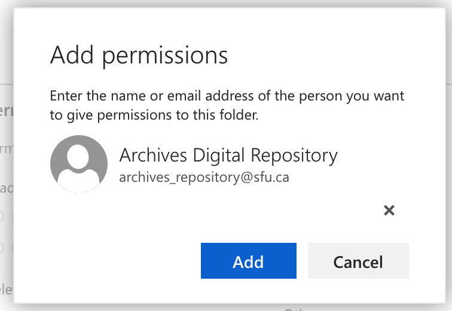
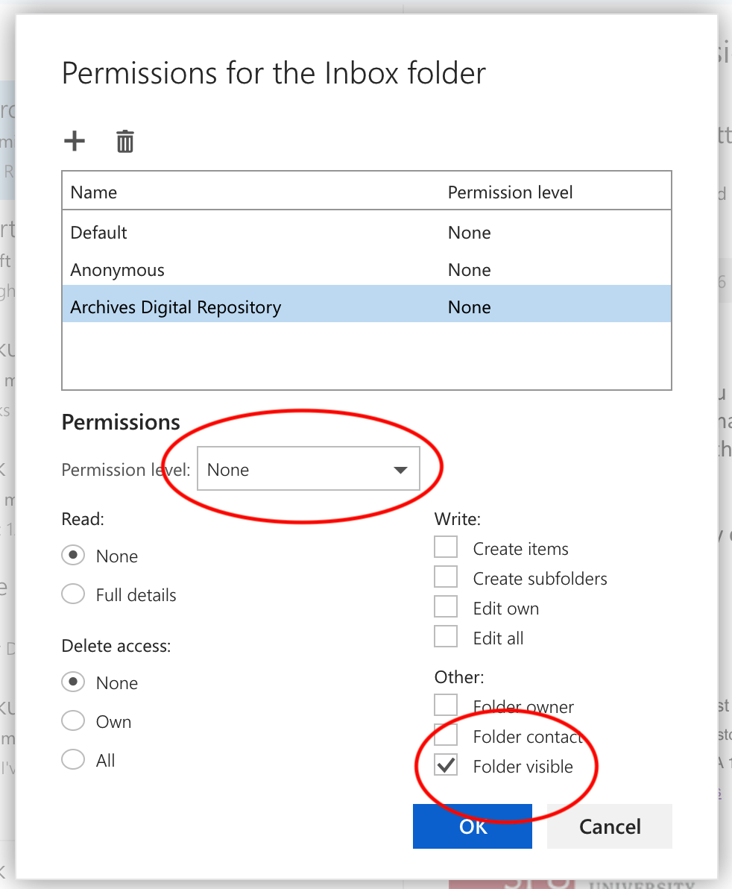
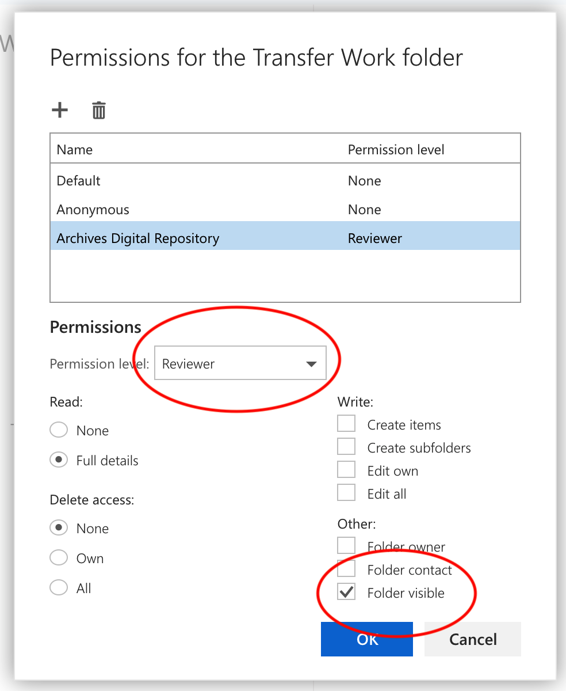
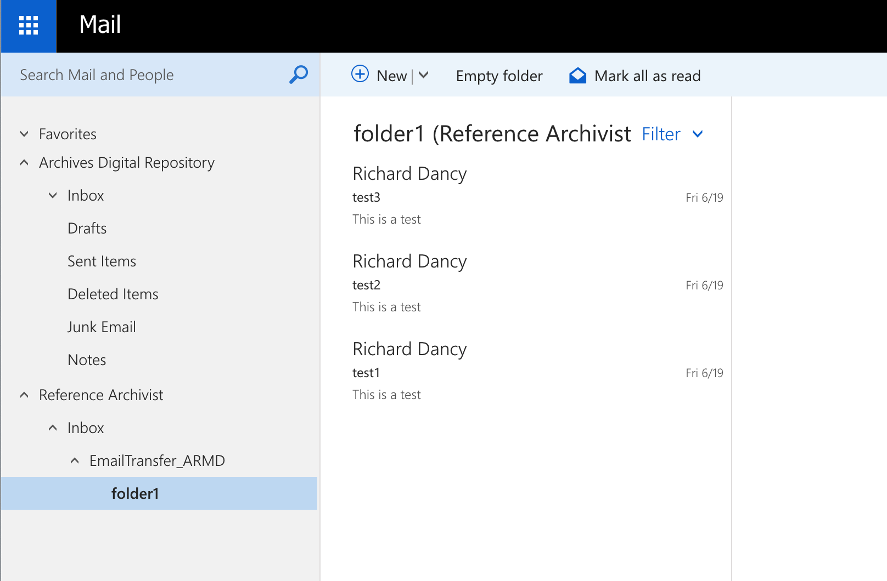

###### [Email Archiving Home](../../README.md) > [Email Transfer Procedures for Account Owners](./account-owners.md)
###### [1. Before You Start](./s1-before-you-start.md) `|` 2. SFU Accounts `|` [3. Non-SFU Accounts](./s3-non-sfu-accounts.md) `|` [4. After Transfer](./s4-after-transfer.md) `|` [5. Checklist](./s5-checklist.md)

# 2. SFU Email Accounts
This section describes how to transfer email from an SFU account.

**Contents**
- [2.1 Set up a transfer folder](#21-set-up-a-transfer-folder)
- [2.2 Add permissions to the Inbox](#22-add-permissions-to-the-inbox)
- [2.3 Add permissions to the transfer folder(s)](#23-add-permissions-to-the-transfer-folders)
- [2.4 Transfer, validation, accessioning](#24-transfer-validation-accessioning)
- [2.5 Remove permissions](#25-remove-permissions)

## 2.1 Set up a transfer folder

The Archives need access to a shared folder in your account in order to transfer email. The Archives works on Mac computers, and Outlook for Mac requires shared folders to be nested under the owner's `Inbox`.

**Steps**

2.1.1 Create a `Transfer folder` in your `Inbox`
- You can name the `Transfer folder` whatever you wish but it must be placed in your `Inbox`

2.1.2 Move all messages or folders you wish to transfer into the `Transfer folder`.
- You can move individual messages or folders containing messages into the `Transfer folder`.
- You can add as many folders-within-folders as you wish, but **be aware that you will need to add permissions to every individual folder** (see [step 2.2](#22-add-permissions-to-the-inbox) and [step 2.3](#23-add-permissions-to-transfer-folders)).

**`In general you should try to maintain messages in their original folder structure as you used them; this provides valuable context for future researchers that will help them understand your email archive.`**

## 2.2 Add permissions to the Inbox

You need to add permissions to every folder (including the `Inbox`) to share them with Archives.
- Permissions should be given to the `archeml` account – this is an account used by Archives uniquely for email transfer.
- The permissions needed on the `Inbox` folder are different (more limited) than those for the other folders.
- The instructions below show how to add permissions; see also [IT Services' help page on sharing folders in Outlook](https://www.sfu.ca/sfumail/using-sfu-mail/sharing/sharing-mail-folders.html).

**Steps**

2.2.1 Right-click the `Inbox` folder and from the popup menu select `Permissions`

 

2.2.2 A new dialog box appears, `Permissions for the Inbox folder`.
- Click the `+` button to add a new permission.

 

2.2.3 A new dialog box appears prompting you to add the email address of the person you wish to share the folder with.
- Enter "archeml" and click the `Search Directory` button.

 

2.2.4 The name `Archives Digital Repository – archives_repository@sfu.ca` should appear.
- Click the `Add` button.

 

2.2.5 The `Archives Digital Repository` will now appear in the list of permissions.
- Make sure it is selected and highlighted.

- Check the box `Folder visible` and leave the `Permission level` drop-down selection to "None."

- Click the `OK` button to complete.
 

These settings mean that your `Inbox` will be visible in the `archeml` account (`Folder visible` = "Yes"") but its contents cannot be viewed or accessed (`Permission level` = "None"); only the folders that you explicitly designate in the next step will be accessible to the Archives.

## 2.3 Add permissions to the transfer folder(s)

Permissions in Outlook are not inherited by sub-folders from a top-level parent folder: **you need to explicitly add permissions to the transfer folder and each sub-folder inside it.**
- Even though a folder is placed within the `Transfer folder`, the Archives will not be able to access its contents unless you explicitly share it with the `archeml` account.

**Steps**

2.3.1 For the `Transfer folder` and every sub-folder contained within it repeat the same steps as you applied to the `Inbox` in [section 2.3 above](#23-add-permissions-to-the-inbox). The only difference is in the last step, where you specify the actual permissions on the folder.
- Select `Archives Digital Repository` so that it is highlighted.
- In the drop-down box labelled `Permission level` select "Reviewer"; the `Folder visible` box will default to checked; make sure to leave it checked.

**Reviewer** permission means that an archivist will have read-only access to the transfer folders, which is all we need to transfer the email.

The screenshot on the left below shows the settings for Reviewer permissions; and on the right an example of how a shared folder appears in the `archeml` account:

  

 

## 2.4 Transfer, validation, accessioning

Your email is now ready for transfer, validation, and accessioning.
- **Transfer** copies the email over to an Archives' account (`archeml`), then exports it from the SFU Mail system.
- **Validation** verifies that all the folders that you intended to transfer were in fact successfully transferred.
- **Accessioning** processes the transferred email into the Archives' digital preservation system.

All of these steps are done by an archivist, but they require communication between the account owner and the Archives.

**Steps**

2.4.1 Advise the Archives when you have finished setting up the transfer folder(s) and added permissions.
- If in doubt about who to contact, send an email to `moveit@sfu.ca` (the Archives' generic account for digital transfers) or `archives@sfu.ca` (the Archives' reference desk).

2.4.2 Receive notification from the Archives that it has transferred the email.
- Transfer occurs behind the scenes. You will not notice any change in your own account and the transfer folder and any sub-folders remain in place.
- An archivist has accessed the transfer folder via the shares you created in [steps 2.2](#22-add-permissions-to-the-inbox) and [2.3](#23-add-permissions-to-the-transfer-folders), copied its contents to the Archives' `archeml` account, and ran a utility (`OfflineImap`) to download the messages and attachments from the SFU mail server to an Archives' computer.

2.4.3 The notification message you receive will include a list of all folder names included in the transfer. Review this list to ensure that the transfer is complete.
- It is possible, for example, that you inadvertently missed some folders when adding permissions in [step 2.3](#23-add-permissions-to-the-transfer-folders).
- If folders are missing from the transfer list, review the permissions on these folders and make sure they have been shared with the Archives.

2.4.4 Reply to the Archives: confirm that the transfer list is either complete; or indicate that folders were missed and that permissions on these folders have been reviewed / added.
- If folders were missed, the Archives will re-run the entire transfer.

2.4.5 Receive an `Transfer Accessioned Notice` from Archives.
- On receipt of your final confirmation, an archivist will accession the transfer (assign it a unique `Accession number`) and upload it to the Archives' digital preservation system (`Archivematica`) to await further processing at a later date.

**`Note that there may be a considerable time lag between completion of transfer (accessioning) and completion of processing (archival description).`**
- For more on this, see [Section 4, What happens to email after transfer?](./s4-after-transfer.md)

## 2.5 Remove permissions

Your transfer is now complete. You should now remove the Archives' permissions from the transfer folders.

**Steps**

2.5.1 Delete the Archives' permission on your `Inbox`.

2.5.2 If you no longer need to access the email messages transferred, you can now delete them from your account.
- But see the caution in [Section 1](./s1-before-you-start): **`once deleted, you will not be able to view transferred email from your SFU account.`**
- The Archives' access protocols are set up for third parties to access historical email collections in an offline environment. If you need continuing access to the email, do not delete it from your account.

2.5.3 If you do retain some or all of the transferred messages, move them to a folder in your account clearly marked as already transferred (e.g. a folder named `Transferred to Archives`, with sub-folders for each Accession Number).
- This ensures that you do not inadvertently transfer the same records later on.

2.5.4 If you plan to regularly transfer email to the Archives in the future, you may wish to retain the same set of transfer folders with their permissions so that you do not have to repeat the process of setting up permissions on every folder and sub-folder.

- The easiest way to do this is to move the set out of your `Inbox`, leave the permission entry on the top-level transfer folder, but change the settings to `Permission level` = "None" and `Folder visible` = unchecked.

- Then later, when you want make another transfer, simply add back the permission settings, move the set of transfer folders to your `Inbox`, and notify the Archives that you are ready to make another transfer.

###### Last updated: Jul 8, 2020
