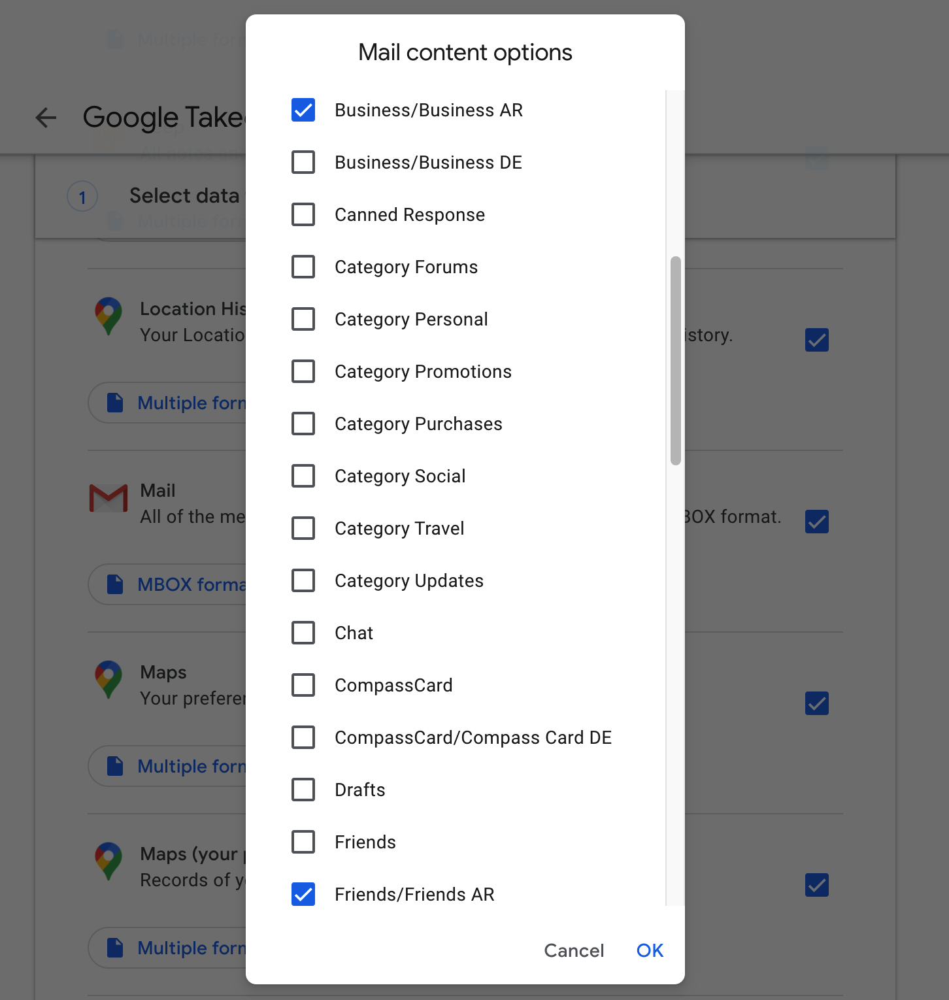

###### [Home](../../README.md) > [Email transfer procedures for account owners](./account-owners.md)
###### [1. Before you start](./s1-before-you-start.md) `|` [2. SFU accounts](./s2-sfu-accounts.md) `|` 3. Non-SFU accounts `|` [4. After transfer](./s4-after-transfer.md) `|` [5. Checklist](./s5-checklist.md)

# 3. Non-SFU email accounts

SFU Archives does not currently hold any email archives from non-SFU accounts. But donations of personal correspondence from non-SFU email systems are possible and will be handled on a case-by-case basis.

In general: non-SFU email must be transferred in `mbox` format or in a format that we can convert into `mbox`.
- The Archives has a script for converting email from `maildir` to `mbox` formats.
- Gmail can be exported by users themselves as `mbox`; the process is documented below.

Note that the Archives will not normally acquire email in the form of Microsoft `pst` files. Our sense is that `pst` files are typically less complete and reliable than `mbox` and that the tools for migrating them are not always robust. Our preference at the present time is to use `OfflineImap` to export email from Microsoft Exchange / Outlook email systems. But our experience to date with this method is restricted to working with SFU email.

## 3.1 Gmail

Individuals wishing to donate private correspondence from their Gmail account may use Google's "takeout service" to export their own email themselves.

Google's takeout service delivers email in `mbox` format. Export and download your email as `mbox` files, then transfer the file(s) to Archives using the Archives' [standard digital transfer procedure and the SFU MoveIt packager](http://www.sfu.ca/archives/digital-repository/transfer-digital-records.html).

When using Google's takeout service, it is vital that you change the default `All Mail data included` settings.

**Steps**

3.1.1 Navigate to your Google account page and log in (https://myaccount.google.com).

3.1.2 Click the `Data and personalization` link on the sidebar.

3.1.3 Scroll down the page and click the `Download your data` link.

3.1.4 On the `Google Takeout` page, scroll down to the `Mail` section.

3.1.5 Click `All Mail data included` button.

3.1.6 In the `Mail contents options` menu, deselect `All Mail` and select the individual mailbox folders you want to export and transfer (even if you select every folder).

The last step (deselect `All Mail`) is critical because it ensures that the original folder structure is preserved, i.e. Google will export each folder as its own `mbox` file rather than simpling creating one big `mbox` file for everything.

Typically it will take some time for Google to prepare your email for download. When it is ready, Google will email your Gmail account with a link to download the `mbox` files.

 

###### Last updated: Jul 9, 2020
